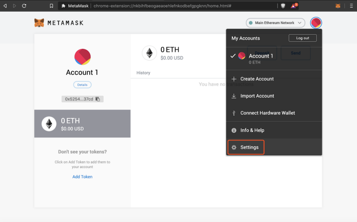

# How to connect to Huobi ECO (HECO) using MetaMask

How to connect to Huobi ECO (HECO) using MetaMask. MetaMask was created out of the need of creating more secure and usable Ethereum-based websites. In particular, it handles account management and connecting the user to the blockchain. It’s supported in Chrome, Brave, and Safari browsers.

## Install 

**Example: Install MetaMask in Brave browser.** Open Extension Category in Brave: [https://chrome.google.com/webstore/category/extensionsSearch](https://chrome.google.com/webstore/category/extensionsSearch) for MetaMask​Warning: Make sure it’s offered by metamask.io

* Click on “Add to Brave”

## Create an account in MetaMask 

1. 1.Click on the “Create a wallet” button

​2. Create a password of at least 8 characters

​3. Click on “Create” and then write down your backup phrase.

4\. Select each phrase in order to make sure it is correct then click “Confirm”.

## Connect Your MetaMask With the Binance Smart Chain 

1. Go to the setting page

2\. Add a new network

**Network Name:** Smart Chain**New RPC URL:** https://bsc-dataseed.binance.org/**ChainID:** 56**Symbol:** BNB**Block Explorer URL:** https://bscscan.com
